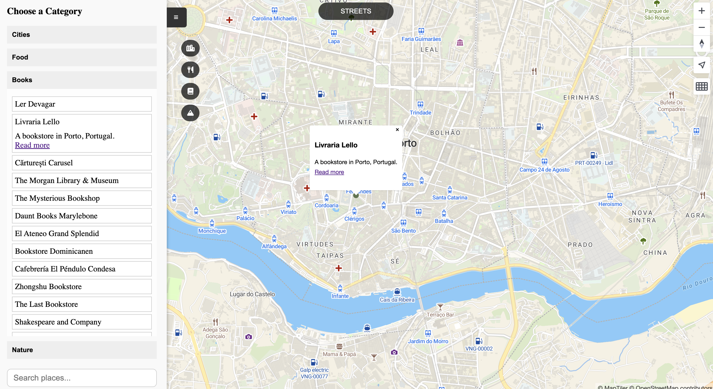

# Map Application

## 🌍 Live Demo
Check out the live version here: [map-a363.onrender.com](https://map-a363.onrender.com)



## Overview
This is an interactive map application that allows users to view cool places around the world categorized by cities, food places, places related to books and nature. Users can view points on the map by category, search for places, click on a location to zoom into that place on the map, and click on the point to see the place's description. It is also possible for the user to switch between globe and projection view, and change the style of the map. 

## Features
- **Interactive Map**: Displays markers for different categories of places.
- **Filter by Category**: Use the sidebar to filter places by categories like cities, food, books, and nature.
- **Search Functionality**: Search for places using the search bar, with real-time suggestions.
- **Zoom to Location**: Click on a place in the sidebar or search suggestions to zoom into its location on the map.
- **Dynamic Popups**: View detailed information about a place, including descriptions and links, in a popup on the map.

## Technologies Used
- **Frontend**:
  - Vanilla JS SPA
  - HTML, CSS
  - [MapTiler SDK](https://www.maptiler.com/) for map rendering
  - Font Awesome for icons
- **Backend**:
  - Node.js
  - PostgreSQL for storing place data
- **API**:
  - RESTful API endpoints for fetching data (`/api/cities`, `/api/food`, `/api/books`, `/api/nature`, `/api/search`)
- **Containerization**:
  - Docker for running the application and database in isolated containers.

## Setup Instructions

### 1. Clone the Repository
```bash
git clone <repository-url>
cd map
```

### 2. Create the `.env` File
Create a `.env` file in the server directory and add the required environment variables. Below is an example of what the `.env` file might look like:

```env
# Example .env file
MAPTILER_API_KEY=your_maptiler_api_key
DATABASE_URL=postgres://username:password@db:5432/map
```

Replace `your_maptiler_api_key`, `username`, `password`, and other placeholders with your actual configuration values.

### 3. Build and Start the Docker Containers
Ensure Docker is installed and running on your system. Then, build and start the containers using `docker-compose`:
```bash
docker-compose up --build
```

### 4. Access the Application
- Open `http://localhost:3009` in your browser to view the application.
  - Frontend: http://localhost:3009
  - Backend API: http://localhost:8000/

### 5. To stop the Containers
To stop the containers, run:
```bash
docker-compose down
```

## Folder Structure
```
map/
├── nginx/
    ├── nginx.conf          # Nginx configuration
├── public/
│   ├── index.html          # Main HTML file
│   ├── style.css           # CSS for styling
│   ├── main.js             # Main JavaScript logic
│   ├── map.js              # Map-related functionality
│   ├── api.js              # API calls to fetch data
├── server/
│   ├── controllers/        # API controllers
│   ├── db/                 # Database initialization and data storing
│       ├── initdb/         # Extensions and database schema
│   ├── app.js              # Express server setup
│   ├── routes/             # API route handlers
├── package.json            # Node.js dependencies
```

## API Endpoints
### GET /api/cities
Fetches a list of cities.

### GET /api/food
Fetches a list of food places.

### GET /api/books
Fetches a list of bookstores.

### GET /api/nature
Fetches a list of nature spots.

### GET /api/search?q=<query>
Fetches search results based on the query.

## How to Use
1. **Explore Categories**:
   - Open the sidebar and click on a category (e.g., Cities, Food, Books, Nature).
   - View the list of places in the selected category.

2. **Search for Places**:
   - Use the search bar to find specific places.
   - Click on a suggestion to zoom into the location on the map.

3. **View Place Details**:
   - Click on a marker on the map to view details about the place in a popup.
   - Click on a place in the sidebar to zoom into its location and view its description.

## Customization
- **Add New Categories**:
  - Update the database schema and seed data.
  - Add new API endpoints in the backend.
  - Update the frontend to include the new category.

- **Change Map Styles**:
  - Modify the `map.setStyle()` method in `map.js` to use a different MapTiler style.

## License
This project is licensed under the MIT License.